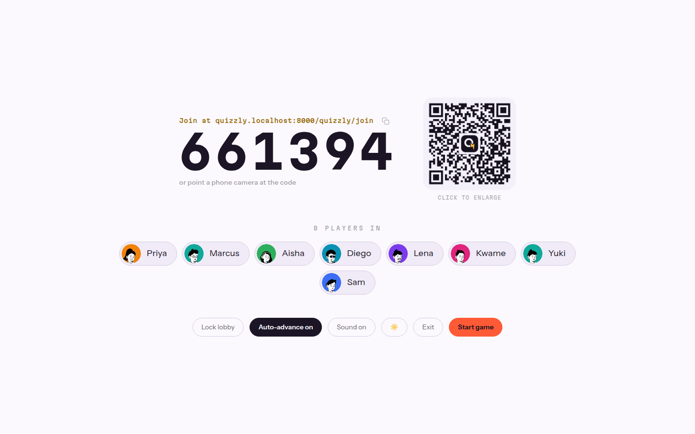
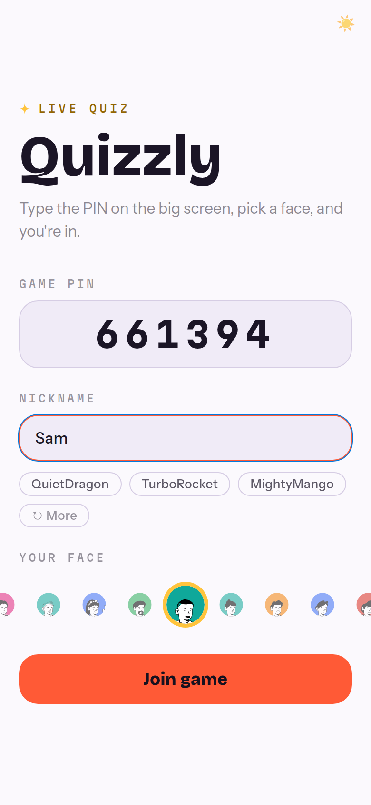
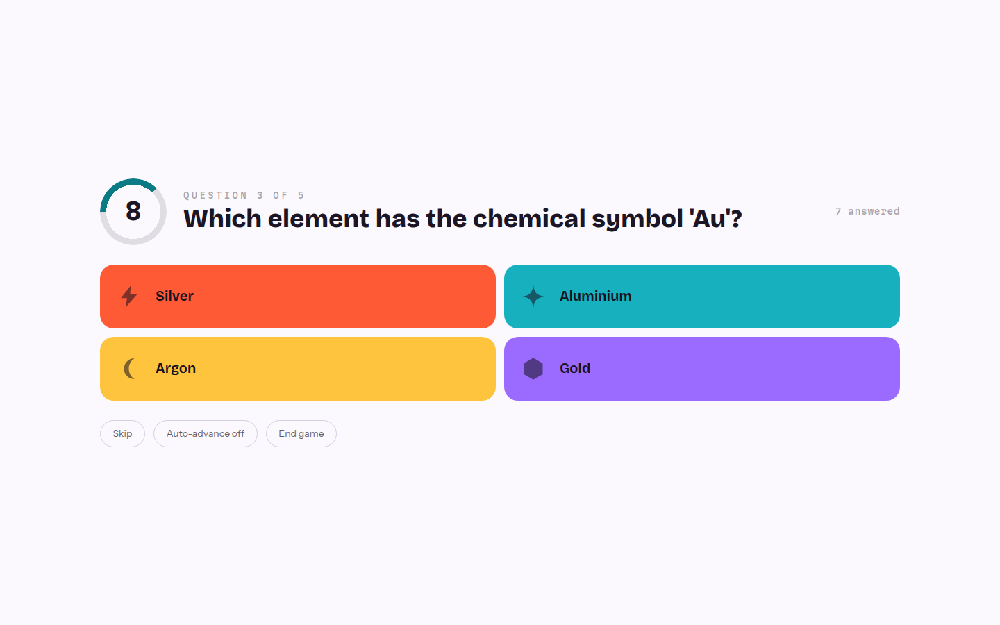
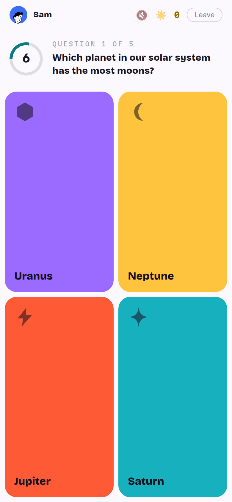
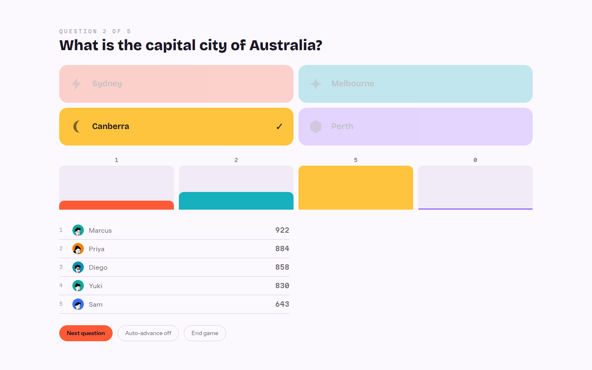
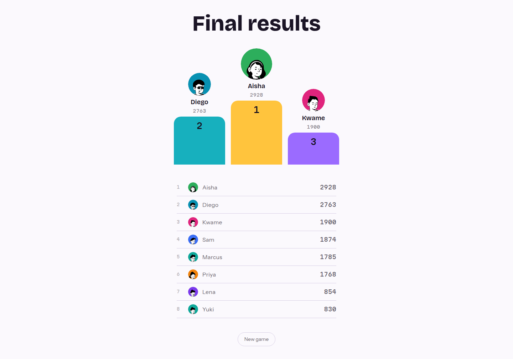
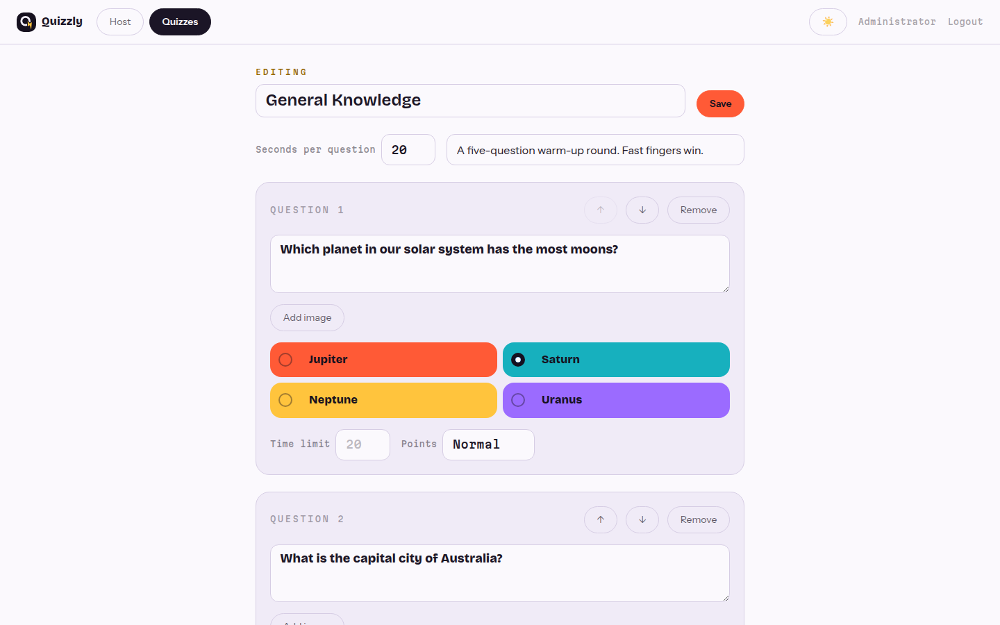
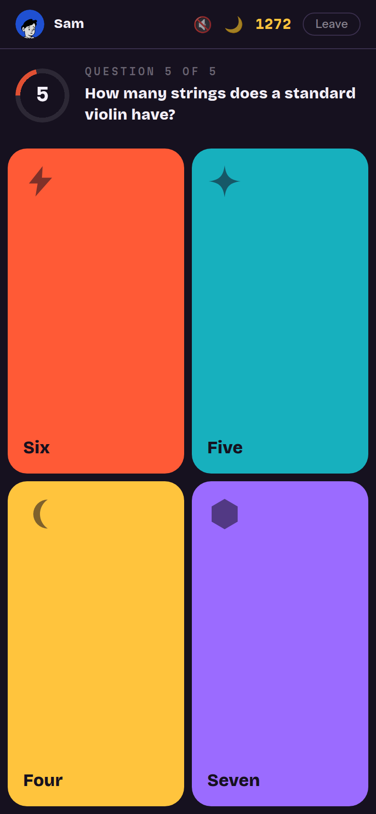

<div align="center">

#  Quizzly

**Live multiplayer quiz, no login required**



</div>

## What it is

Quizzly is a live quiz game built on the Frappe Framework. A host puts the game
PIN on the big screen, players join from their phones with the PIN or by
scanning the QR code, and nobody needs an account.

Gameplay is server-authoritative. The correct answer never reaches a player's
device before the question closes, scores are computed from a server-set
deadline, and every submission is validated against the server's own view of
the game.

<details>
<summary>Screenshots</summary>

**Joining from a phone**



**A question, live on both screens**





**Between questions**



**Final results**



**Writing a quiz**



**Light and dark**



</details>

## Features

- Guests join with a PIN or QR code, no account and no app install
- Live lobby: names appear as players join, host can lock it or kick anyone
- Questions land on every device at once, with a per-question timer
- Speed-scaled scoring with streak bonuses, in the style of the games it borrows from
- Answer distribution, correct answer reveal and top-five leaderboard between questions
- Top-three podium at the end, plus the full ranking
- Avatar picker and nickname suggestions for players
- Light and dark theme, everywhere
- Quizzes are written in the app, no Desk trip needed

## Under the hood

- [Frappe Framework](https://github.com/frappe/frappe) for the backend, DocTypes and permissions
- [Vue 3](https://vuejs.org) and [frappe-ui](https://github.com/frappe/frappe-ui) for the single-page app
- [Socket.IO](https://socket.io) to push every state change to hosts and players
- Redis for the hot session state each answer is validated against
- RQ for the single shared ticker that drives every live game loop

## Development setup

1. Set up a bench by following the
   [installation steps](https://frappeframework.com/docs/user/en/installation)
   and start the server with `bench start`.

2. In another terminal, from your bench directory:

```bash
bench get-app https://github.com/gajjug004/quizzly --branch develop
bench --site your-site.localhost install-app quizzly
```

The app is served at `/quizzly` on your site. For frontend work, run the Vite
dev server against it:

```bash
cd apps/quizzly/frontend
yarn install
yarn dev
```

## Testing

```bash
bench --site your-site.localhost set-config allow_tests true
bench --site your-site.localhost run-tests --app quizzly
```

## Contributing

This app uses `pre-commit` for code formatting and linting. Please
[install pre-commit](https://pre-commit.com/#installation) and enable it for
this repository:

```bash
cd apps/quizzly
pre-commit install
```

Pre-commit is configured to use ruff, eslint, prettier and pyupgrade.

`plan.md` holds the build plan and architecture, `specs/` holds the spec for
each phase, and `progress.md` logs what was actually built.

## License

MIT
